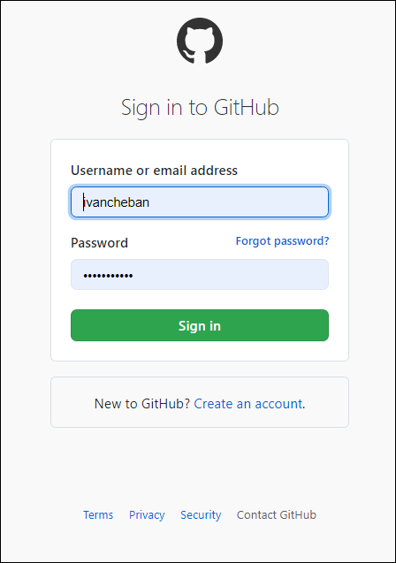
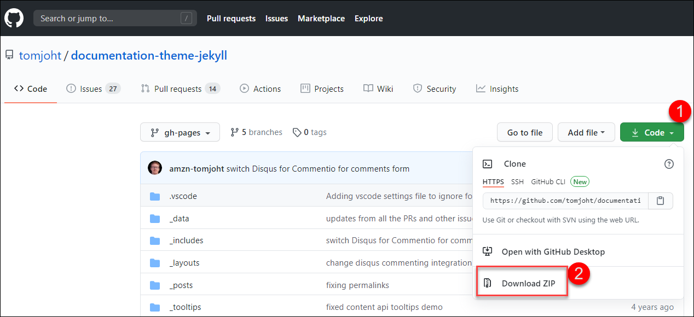
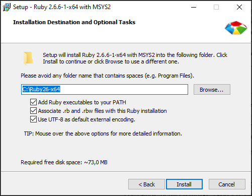

# Jekyll

> When I first started exploring the CI/CD and the SSGs, the first generator that I learned was Jekyll. I used [Getting started with the Documentation Theme for Jekyll](https://idratherbewriting.com/documentation-theme-jekyll/) by Tom Johnson, the famous guru of technical writing known by his [I'd Rather Be Writing blog](https://idratherbewriting.com/). So without too many words, let's start building our first documentation portal using Tom's Jekyll theme. I will try to explain even the evident things.

Our goal is to build and publish the documentation site using Jekyll and Netlify. The end result will look like this: [https://sample-jekyll.netlify.app](https://sample-jekyll.netlify.app)

### Download the theme from the GitHub repo

1. Sign up for GitHub.

   

2. If you already have the account there, sign in.

   

3. Go to [Tom's repository](https://github.com/tomjoht/documentation-theme-jekyll).

   

4. Click the **Code** button and select **Download ZIP**.

   

5. Save the ZIP file to your computer and unzip the contents where you like. Now you have the folder with code and content. Let's proceed with building our documentation site from all this.

### Install Ruby on Windows

> Before we install Jekyll that compiles our site, we need to install Ruby. Jekyll is a Ruby-based program and needs Ruby to run.

1. Go to [RubyInstaller for Windows](https://rubyinstaller.org/downloads/).

2. Install the recommended **Ruby+Devkit 2.6.X (x64)** version.

    

3. Install everything by default.

    

4. When the installation completes, you see this command prompt screen. Press **Enter**`** two times when prompted.

    

5. When the installation in the command prompt exits, let's assume that we have Ruby installed. If you want to make sure, open the command prompt and type `ruby -v` and press **Enter**.

    

---

## Install Jekyll