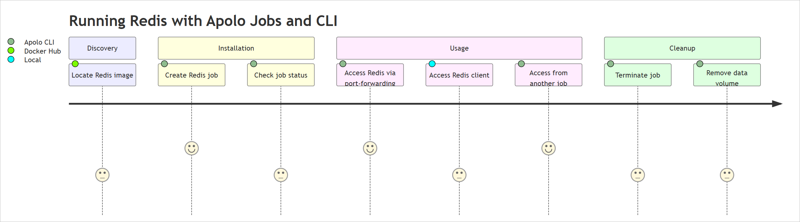
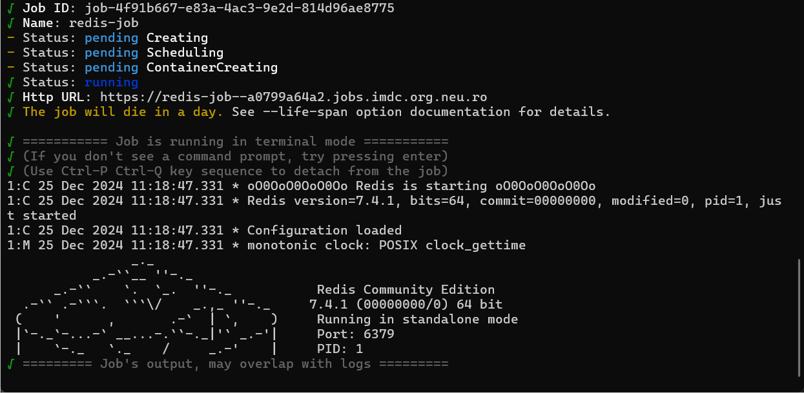
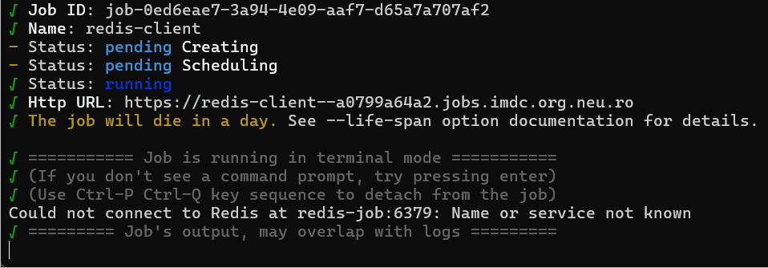

# Running Redis with Apolo Jobs and CLI

## Overview

This guide walks you through the process of running Redis with Apolo Jobs and Apolo CLI. Redis is an open-source, in-memory data store commonly used as a database and cache. The guide covers the following aspects:

- [Discovery:](#discovery) Locating a publicly available container image, identifying its version, and recording essential details.
- [Installation:](#installation) Setting up Redis using Apolo Jobs, including necessary configuration steps and Apolo CLI commands.
- [Usage:](#usage) Verifying that a Redis job is operational and accessing the database through other jobs or Apolo CLI using port-forwarding.
- [Cleanup:](#cleanup) Restoring the system to its original state.
- [Persistence configuration:](#configuring-redis-with-apolo-files-for-persistence) Configuring Redis with Apolo files for persistence.



## Prerequisites

Before you begin, ensure you have the following:

- [Authenticated with Apolo](https://docs.apolo.us/index/core/getting-started/sign-up-login)
- [Apolo CLI installed](https://docs.apolo.us/index/cli/installing)
- [Access to a compute cluster and project](https://docs.apolo.us/index/core/getting-started/organizations)
- [Redis CLI installed](https://redis.io/docs/latest/operate/oss_and_stack/install/install-redis/install-redis-on-windows/)

## Discovery

To locate a publicly available Redis container image:

1. Visit the official [Redis Docker Hub repository](https://hub.docker.com/_/redis).
1. On the Redis Docker Hub page, find a "Tags" section that lists all the available tags (versions) for the Redis Docker image.

    > **Note:**
    >
    > You can also check the latest version of Redis in their [Release Notes](https://github.com/redis/redis/releases).

1. Identify the official Redis image and note its version (for example, `redis:7.4.1`).

## Installation

1. Create a Redis job using the Apolo CLI:

    ```sh
    apolo run --name redis-job --preset cpu-small --volume storage:redis-data:/data:rw redis:7.4.1 -- --port 6379
    ```

> **Note:**
>
> You can access your dataset from within a container by giving `--volume storage:data/:/var/storage/data/:rw` to `apolo run` as a parameter when starting a new job. For more information, see [Configuring Redis with Apolo files for persistence](#configuring-redis-with-apolo-files-for-persistence).

    The terminal output shows the created Redis job ID and other information:

    

1. Check the status of the Redis job:

    ```sh
    apolo ps
    ```

Ensure the job is running and note the job ID. For example: `job-4f91b667-e83a-4ac3-9e2d-814d96ae8775`

## Usage

1. To access the Redis database from your local machine, use port-forwarding:

    ```sh
    apolo port-forward <job-id> 6380:6379
    ```

    > **Note:**
    >
    > Replace `<job-id>` with your Redis job ID. For example, `apolo port-forward job-4f91b667-e83a-4ac3-9e2d-814d96ae8775 6380:6379`

1. You can now access the Redis database using a Redis client:

    ```sh
    redis-cli -h localhost -p 6379
    ```

    The `localhost:6379>` prompt output indicates that the connection was successful, and you can now start interacting with the Redis server using the Redis CLI.

1. To access Redis from another job, create a new job and connect to the Redis job using the internal hostname:

    ```sh
    apolo run --name redis-client --preset cpu-small --volume storage:redis-data:/data:rw redis:7.4.1 -- redis-cli -h redis-job -p 6379
    ```

    

## Cleanup

To restore the system to its original state:

1. Terminate the Redis jobs:

    ```sh
    apolo job kill <job ID> <another job ID>
    ```

    > **Note:**
    >
    > Replace `<job ID>` and `<another job ID>` with the IDs of your actual jobs. To view the running jobs, use: `apolo ps`. To view all jobs regardless of their status, use: `apolo ps --all`.

1. Remove the Redis data:

    ```sh
    apolo storage rm -r storage:redis-data
    ```

    This removes directories and their contents recursively.

## Configuring Redis with Apolo files for persistence

To configure Redis to use Apolo Files for data persistence, you can mount a storage volume to the Redis container. This will allow Redis to store its data on the Apolo Files storage system, ensuring that the data persists even if the Redis container is stopped or restarted.

1. Create a new storage volume for Redis data:

    ```sh
    apolo storage mkdir storage:redis-data
    ```

1. Run the Redis job with the storage volume mounted to the `/data` directory inside the container:

    ```sh
    apolo run --name redis-job --preset cpu-small --volume storage:redis-data:/data:rw redis:7.4.1 -- --port 6379
    ```

In this command:

- `--volume storage:redis-data:/data:rw` mounts the `redis-data` storage volume to the `/data` directory inside the Redis container with read-write permissions.
- `--port 6379` exposes the Redis port 6379 to allow access to the Redis database.

With this configuration, Redis will store its data in the `redis-data` storage volume, which is managed by the Apolo Files system. This ensures that your Redis data is persisted and can be accessed by other jobs or applications that mount the same storage volume.

You can also manage the `redis-data` storage volume using the Apolo CLI or the Files application interface, allowing you to perform operations like copying, moving, or deleting the Redis data as needed.

For more information, see [Mounting Storage in Jobs](https://docs.apolo.us/index/core/apps/pre-installed/files#mounting-storage-in-jobs).
